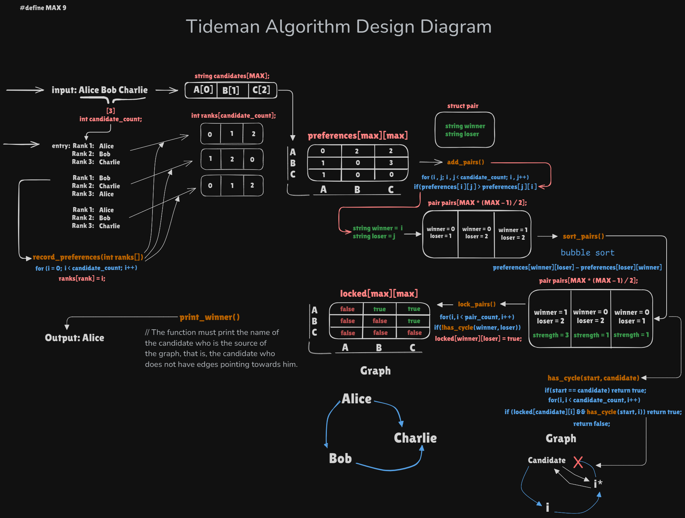

# Tideman Algorithm Visualization

## Description
This repository contains a complete implementation of the Tideman algorithm, also known as the ranked pairs method, used in ranked-choice elections to determine the winner without the need for a runoff system. The algorithm prevents the occurrence of cycles and ensures correct ordering of candidates based on voter preferences.

## Context
This project is part of an activity from the [CS50x: Introduction to Computer Science](https://cs50.harvard.edu/x) course by Harvard University. It was developed to reinforce the programming, algorithms, and data structures concepts learned throughout the course.

### Important Note
This repository was created **for educational and personal reference purposes only**. **It should not be used for cheating or violating academic policies**. If you are taking the CS50x course, I strongly encourage you to try solving the problems on your own before consulting this repository. Learning to tackle challenges independently is an essential part of the learning process!

## Repository Files

- **`tideman.c`**: Source code of the Tideman algorithm implementation in C.
- **`tideman-algorithm-design-diagram.png`**: Image illustrating the flow and interaction of the Tideman algorithm functions.
- **`tideman-diagram-archive.excalidraw`**: Editable diagram file created with [Excalidraw](https://excalidraw.com/), useful for future modifications.
- **`tideman`**: Compiled executable file of the `tideman.c` source code.

## Algorithm Design Diagram

Below is a diagram that illustrates how the Tideman algorithm works, from recording voter preferences to determining the final winner. It includes the main functions such as `record_preferences`, `add_pairs`, `sort_pairs`, `lock_pairs`, and `print_winner`.



## How to Run

1. **Compile** the `tideman.c` code (if the executable is not yet available):
   ```bash
   gcc -o tideman tideman.c -lcs50
   ```

2. **Run** the compiled file:
   ```bash
   ./tideman [candidate ...]
   ```

3. Follow the instructions in the console to enter the voters' preferences and see the final result.

## Diagram Details

The `tideman-algorithm-design-diagram.png` diagram demonstrates the following flow:

- **Input**: List of candidates and their ranks as specified by voters.
- **Function `record_preferences`**: Records voters' preferences for each candidate pair.
- **Function `add_pairs`**: Creates a list of winning and losing candidate pairs based on preferences.
- **Function `sort_pairs`**: Sorts the pairs in order of strength of victory.
- **Function `lock_pairs`**: Locks the pairs in the preference graph without creating cycles.
- **Function `print_winner`**: Determines and prints the final winner of the election.

## Project Context
This project is part of the CS50x curriculum and was created as a practical exercise to apply the concepts learned during the course. The code implements the logic of the Tideman algorithm and aims to strengthen the understanding of sorting algorithms and graph theory.

## Usage Warning
This repository should not be used for cheating or violating the academic policies of any educational institutions. If you are currently taking the CS50x or any other course, we recommend solving the problems independently before consulting the code presented here.

## License

This project is distributed under the MIT license. See the `LICENSE` file for more details.
